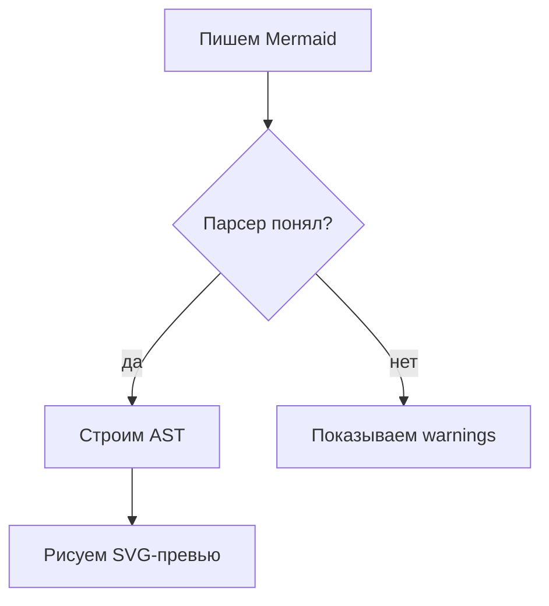

# mpl — Mermaid Processor Lite

Статус: `draft`  
Зрелость: `M2`  
Флаги: `G`  
Основной интерфейс: `gui`  
GUI: `Qt` через `PySide6`, с fallback на `PyQt6`

## Что делает

`mpl` — простой локальный Mermaid-процессор для DIY-workspace. Он берёт Mermaid-подобный текст, разбирает его в AST JSON и рисует SVG-превью. Главный смысл первой версии — не идеальная совместимость с Mermaid, а быстрый визуальный процессинг диаграмм без браузера, node.js и mermaid-cli.

## Когда использовать

- Нужно быстро накидать flowchart/graph-диаграмму и увидеть картинку.
- Нужно встроить Mermaid-subset в другой DIY-инструмент через Python API или JSON ABI.
- Нужно получить SVG без внешнего процесса и без сетевых зависимостей.

## Быстрый запуск

Сначала для GUI нужен Qt binding:

```bash
pip install -r requirements.txt
```

Windows:

```powershell
run.bat
```

Linux:

```bash
./run.sh
```

CLI напрямую:

```bash
python main.py --cli --input examples/input/basic_flow.mmd --svg out.svg --ast out.ast.json
```

ABI через stdin JSON:

```bash
printf '{"source":"flowchart TD\nA[Старт] --> B[Финиш]","render":true}' | python main.py --cli --abi-json
```

## Вход

Поддерживается UTF-8 Mermaid-subset:



Минимально поддержаны:

- заголовки `graph TD/LR/RL/BT` и `flowchart TD/LR/RL/BT`;
- узлы `A[Text]`, `A(Text)`, `A((Text))`, `A{Text}`, `A[[Text]]`, `A[(Text)]`, `A{{Text}}`;
- стрелки `-->`, `---`, `-.->`, `==>`, `<-->`;
- подписи `A -->|text| B`, `A -- text --> B`, `A -. text .-> B`;
- `subgraph ...` / `end` как визуальные группы, включая простые стрелки к группе по её id;
- русские подписи в узлах и стрелках;
- комментарии строкой `%% comment`.

## Выход

Инструмент может показать или создать:

- SVG-превью в Qt GUI;
- SVG-файл через CLI;
- AST JSON через CLI/API/ABI;
- предупреждения по неподдержанным строкам.

GUI рисует картинку в памяти через SVG-превью. Большие схемы показываются в прокручиваемой области с масштабом `-`, `+`, `100%` и `По ширине`, чтобы они не сжимались до нечитаемого размера. SVG-renderer использует контрастную светлую тему, ортогональные ломаные рёбра, отдельные порты для fan-out-связей, compact-cluster раскладку top-level `subgraph`, перенос слишком широких слоёв и явный порядок слоёв отрисовки. Сохранение в PNG в первой версии не нужно. SVG можно сохранить вручную кнопкой `Сохранить SVG`.

## Побочные эффекты и предупреждения

- Удаляет файлы: нет.
- Перезаписывает файлы: только если пользователь сам укажет выходной путь CLI или сохранит SVG через GUI.
- Использует сеть: нет.
- Запускает внешние команды: нет.
- Может ли report содержать приватные данные: возможно, если пользователь вставил приватный текст в диаграмму.

## Интерфейсы

| Слой | Статус | Комментарий |
|---|---|---|
| core | yes | Парсер, модель, layout, SVG renderer |
| api | yes | `process_text()` и `process_file()` |
| abi | json_contract | stdin/stdout JSON-контракт `mpl-json 0.1` |
| cli | yes | Файлы, stdin, JSON, SVG/AST output |
| gui | yes_qt | Qt-редактор и SVG-превью |
| apk | no | Телефонного сценария нет |
| web_localhost | no | Браузер не требуется |

## Зависимости

- Python: `>=3.11`
- Core/API/ABI/CLI: только стандартная библиотека Python
- GUI: `PySide6>=6.6`; если его нет, пробуется `PyQt6`
- External: `none`
- Network: `none`

## Примеры

SVG и AST:

```bash
python main.py --cli --input examples/input/subgraph_ru.mmd --svg subgraph.svg --ast subgraph.ast.json
```

Только JSON в stdout:

```bash
python main.py --cli --input examples/input/basic_flow.mmd --json
```

Python API:

```python
from mpl.api import process_text

result = process_text("flowchart TD\nA[Старт] --> B[Финиш]")
print(result["diagram"])
print(result["svg"])
```

## Проверка

Из папки инструмента:

```bash
python scripts/smoke_test.py
```

Smoke проверяет:

- core parsing;
- русский текст;
- SVG generation;
- отсутствие silent-adopt багов у внешних ссылок из subgraph;
- отсутствие визуального наложения top-level subgraph на внешние узлы;
- ABI JSON;
- CLI output в временную папку.

## Как изменить под себя

- Парсер: `src/mpl/core/parser.py`.
- Модель AST: `src/mpl/core/model.py`.
- Простая раскладка: `src/mpl/core/layout.py`; там же защита от раздувания canvas на циклах, compact-cluster раскладка top-level subgraph, перенос широких слоёв и базовая сортировка узлов для уменьшения пересечений.
- SVG: `src/mpl/core/svg_renderer.py`; там же контрастная тема, ортогональная маршрутизация и z-order слоёв.
- Python API: `src/mpl/api/facade.py`.
- JSON ABI: `src/mpl/abi/json_contract.py`.
- CLI: `src/mpl/cli.py`.
- Qt GUI: `src/mpl/gui/qt_app.py`.

## Граница применимости

Это не полный Mermaid. Не обещаны sequence/class/state/gantt/ER-диаграммы, точное совпадение с Mermaid CLI, темы Mermaid, CSS-классы, интерактивные click-события и идеальная раскладка сложных циклических графов. Текущая раскладка стала заметно читабельнее, но это всё ещё lightweight-layout, а не Graphviz. Для очень плотных графов возможны пересечения, но subgraph больше не должен затягивать в себя внешние узлы только из-за bare-ссылки или накрывать внешнюю часть схемы огромной рамкой.

Если строка похожа на Mermaid, но не поддержана, инструмент старается не падать, а добавить warning и продолжить.
