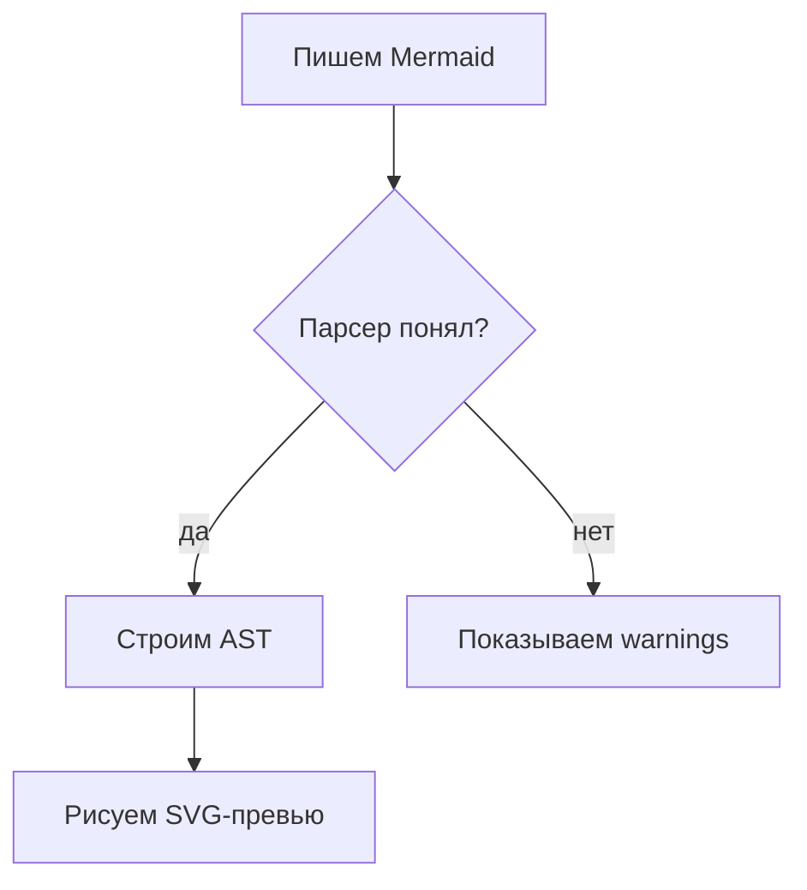

# mpl — Mermaid Processor Lite

Статус: `tested`  
Зрелость: `M3`  
Флаги: `G`  
Основной интерфейс: `gui`  
GUI: `Qt` через `PySide6`, с fallback на `PyQt6`

## Что делает

`mpl` — простой локальный Mermaid-процессор для DIY-workspace. Он берёт Mermaid-подобный текст, разбирает его в AST JSON и рисует SVG-превью. Главный смысл — не идеальная совместимость с Mermaid, а быстрый визуальный процессинг диаграмм без браузера, node.js и mermaid-cli.

## Когда использовать

- Нужно быстро накидать flowchart/graph-диаграмму и увидеть картинку.
- Нужно встроить Mermaid-subset в другой DIY-инструмент через Python API или JSON ABI.
- Нужно получить SVG без внешнего процесса и без сетевых зависимостей.

## Быстрый запуск

Сначала для GUI нужен Qt binding:

```bash
pip install -r requirements.txt
```

Windows:

```powershell
run.bat
```

Linux:

```bash
sh run.sh
```

Без аргументов launcher открывает GUI. Если Qt не установлен, вместо окна будет понятное сообщение и код возврата 5; CLI при этом работает.

CLI (Qt не нужен) — напрямую или через launcher с `--cli`:

```bash
python main.py --cli --input examples/input/basic_flow.mmd --svg out.svg --ast out.ast.json
sh /путь/к/mpl/run.sh --cli --input "моя схема.mmd" --svg "моя схема.svg"
```

Launcher не меняет текущую папку, поэтому относительные пути считаются от папки, где ты находишься. После записи файлов CLI печатает итог: `Готово.`, счётчики, предупреждения, `Результат:` и `Отчёт:`.

ABI через stdin JSON:

```bash
printf '{"source":"flowchart TD\nA[Старт] --> B[Финиш]","render":true}' | python main.py --cli --abi-json
```

## Вход

Поддерживается UTF-8 Mermaid-subset:


```mermaid
flowchart TD
    A[Пишем Mermaid] --> B{Парсер понял?}
    B -- да --> C[Строим AST]
    B -- нет --> D[Показываем warnings]
    C --> E[Рисуем SVG-превью]
```

Минимально поддержаны:

- заголовки `graph TD/LR/RL/BT` и `flowchart TD/LR/RL/BT`;
- узлы `A[Text]`, `A(Text)`, `A((Text))`, `A{Text}`, `A[[Text]]`, `A[(Text)]`, `A{{Text}}`;
- стрелки `-->`, `---`, `-.->`, `==>`, `<-->`;
- цепочки в одной строке: `A --> B -- да --> C`;
- подписи `A -->|text| B`, `A -- text --> B`, `A -. text .-> B`;
- `subgraph ...` / `end` как визуальные группы, включая простые стрелки к группе по её id;
- русские подписи в узлах и стрелках;
- комментарии строкой `%% comment`;
- несколько инструкций в строке через `;`, перенос в подписи узла через `<br>`.

Не поддержано (молча даёт странный узел или предупреждение, см. AST): `A & B --> C`, `class`/`style`/`click`, типы диаграмм кроме flowchart/graph.

## Выход

Инструмент может показать или создать:

- SVG-превью в Qt GUI;
- SVG-файл через CLI;
- AST JSON через CLI/API/ABI — это и есть audit output: по нему видно, что понял парсер;
- предупреждения по неподдержанным строкам (в AST, в итоговом отчёте CLI и строкой `warnings: N` на картинке).

Результат — best-effort: перед тем как вставлять картинку в документ, посмотри на неё глазами и сверь AST с исходным текстом.

GUI рисует картинку в памяти через SVG-превью. Большие схемы показываются в прокручиваемой области с масштабом `-`, `+`, `100%` и `По ширине`, чтобы они не сжимались до нечитаемого размера. SVG-renderer использует контрастную светлую тему, ортогональные ломаные рёбра, отдельные порты для fan-out-связей, compact-cluster раскладку top-level `subgraph`, перенос слишком широких слоёв и явный порядок слоёв отрисовки. Сохранения в PNG нет. SVG можно сохранить вручную кнопкой `Сохранить SVG`.

## Побочные эффекты и предупреждения

- Удаляет файлы: нет.
- Перезаписывает файлы: только если пользователь сам укажет выходной путь CLI или сохранит SVG через GUI.
- Использует сеть: нет.
- Запускает внешние команды: нет.
- Может ли report содержать приватные данные: возможно, если пользователь вставил приватный текст в диаграмму.

## Интерфейсы

| Слой | Статус | Комментарий |
|---|---|---|
| core | yes | Парсер, модель, layout, SVG renderer |
| api | yes | `process_text()` и `process_file()` |
| abi | json_contract | stdin/stdout JSON-контракт `mpl-json 0.1`, версия контракта 1 |
| cli | yes | Файлы, stdin, JSON, SVG/AST output |
| gui | yes_qt | Qt-редактор и SVG-превью |
| apk | no | Телефонного сценария нет |
| web_localhost | no | Браузер не требуется |

## Зависимости

- Python: `>=3.11`
- Core/API/ABI/CLI: только стандартная библиотека Python
- GUI: `PySide6>=6.6`; если его нет, пробуется `PyQt6`
- External: `none`
- Network: `none`

## Примеры

SVG и AST:

```bash
python main.py --cli --input examples/input/subgraph_ru.mmd --svg subgraph.svg --ast subgraph.ast.json
```

Только JSON в stdout:

```bash
python main.py --cli --input examples/input/basic_flow.mmd --json
```

Python API:

```python
from mpl.api import process_text

result = process_text("flowchart TD\nA[Старт] --> B[Финиш]")
print(result["diagram"])
print(result["svg"])
```

## Контракт

Версия контракта: `1` (ABI `mpl-json 0.1`). Указатель — [docs/CONTRACT.md](docs/CONTRACT.md), полное описание (аргументы CLI, коды возврата, поля JSON и AST, stdout/stderr, что в контракт не входит) — [docs/ABI.md](docs/ABI.md). Весь JSON, который выдаёт инструмент, содержит `"contract_version": 1`. Пиксельная раскладка SVG в контракт не входит.

## Проверка

Из любой папки, нужен только Python 3.11+ (Qt не нужен):

```bash
python scripts/smoke_test.py
```

Smoke проверяет:

- регрессию: каждый `examples/input/*.mmd` прогоняется через настоящий CLI, AST JSON и SVG сравниваются целиком с `examples/output_expected/` (нормализуется только перевод строки в самом конце файла);
- что `--json` и `--abi-json` дают тот же AST и SVG плюс `abi` и `contract_version`;
- ошибки: `--strict` на `malformed_warnings.mmd` (код 2, эталон JSON ошибки), `--fail-on-warning` (код 3), отсутствующий файл, плохой ABI JSON;
- запуск отдельным процессом из другой папки с пробелами и кириллицей в путях, с разными `PYTHONHASHSEED`, и через `run.sh`;
- итоговый отчёт CLI и наличие audit output (AST) для флага `G`;
- инварианты раскладки: внешняя ссылка из subgraph не затягивает узел в группу, группы не накладываются друг на друга и не накрывают внешние узлы, слои SVG идут в правильном порядке;
- что без PySide6/PyQt6 запуск GUI даёт русское сообщение и код 5, а не traceback;
- что `tool.ini`, код, `docs/` и `CHANGELOG.md` называют одну и ту же версию.

Smoke НЕ проверяет:

- Qt GUI (окно, превью, масштаб, сохранение SVG) — только вручную: `python main.py`, вставить пример, нажать «Отрисовать»;
- Windows и `run.bat` (статус `expected`: текст `run.bat` проверяется, но не запускается);
- читаемость картинки: эталоны фиксируют текущую раскладку, а не доказывают, что она красивая.

Проверено на Linux с Python 3.11, 3.12 и 3.13.

Если раскладка или парсер изменены намеренно, эталоны пересоздаются настоящим CLI из папки капсулы, после чего изменения стоит просмотреть глазами и записать в `CHANGELOG.md`:

```bash
for f in examples/input/*.mmd; do n=$(basename "$f" .mmd); python main.py --cli --input "$f" --svg "examples/output_expected/$n.svg" --ast "examples/output_expected/$n.ast.json"; done
printf '{"input_path":"examples/input/malformed_warnings.mmd","strict":true}' | python main.py --cli --abi-json > examples/output_expected/malformed_warnings.strict_error.json
```

## История

См. [CHANGELOG.md](CHANGELOG.md).

## Как изменить под себя

- Парсер: `src/mpl/core/parser.py`.
- Модель AST: `src/mpl/core/model.py`.
- Простая раскладка: `src/mpl/core/layout.py`; там же защита от раздувания canvas на циклах, compact-cluster раскладка top-level subgraph, перенос широких слоёв и базовая сортировка узлов для уменьшения пересечений.
- SVG: `src/mpl/core/svg_renderer.py`; там же контрастная тема, ортогональная маршрутизация и z-order слоёв.
- Python API: `src/mpl/api/facade.py`.
- JSON ABI: `src/mpl/abi/json_contract.py`.
- CLI: `src/mpl/cli.py`.
- Qt GUI: `src/mpl/gui/qt_app.py`.

## Граница применимости

Это не полный Mermaid. Не обещаны sequence/class/state/gantt/ER-диаграммы, точное совпадение с Mermaid CLI, темы Mermaid, CSS-классы, интерактивные click-события и идеальная раскладка сложных циклических графов. Текущая раскладка — best-effort lightweight-layout, а не Graphviz. В плотных графах рёбра пересекаются, могут проходить поверх узлов и рамок групп, а подписи рёбер — оказываться под узлами; обратные рёбра часто ложатся поверх прямых. Но subgraph больше не должен затягивать в себя внешние узлы только из-за bare-ссылки или накрывать внешнюю часть схемы огромной рамкой.

Если строка похожа на Mermaid, но не поддержана, инструмент старается не падать, а добавить warning и продолжить.
